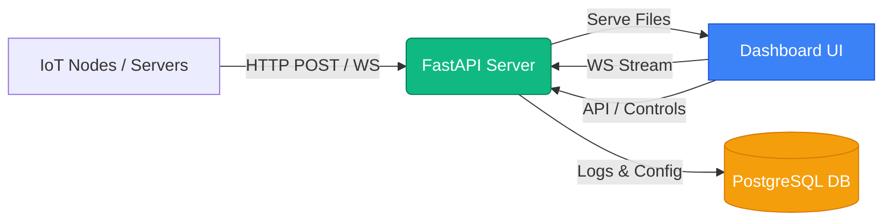

# HomePulse

HomePulse is a community-focused, highly modular telemetry monitoring and dashboard platform inspired by Home Assistant's Lovelace design. It is designed to consume real-time telemetry from local hardware, servers, and microcontrollers and display it on a fast, modern responsive dashboard.

---

## Architecture Overview



- **Frontend**: A single-page application built on HTML5, Vanilla JavaScript (ES6), and beautiful custom CSS styling. There are no heavy UI frameworks or Tailwind compilation steps needed. Rendered icons are provided dynamically via [Lucide Icons](https://lucide.dev/).
- **Backend**: A python-based `FastAPI` application serving static frontend files, establishing REST endpoint routers, running telemetry logging pipelines, and hosting WebSocket connections for live client synchronization.
- **Database**: `PostgreSQL` is utilized as the persistent storage layer for storing device configurations, approved endpoints, security tokens, system audits, and a high-frequency telemetry history.

---

## Advanced Lovelace YAML Dashboard

HomePulse features a fully-customizable dashboard interface that mimics Home Assistant’s Lovelace engine. The layout is stored inside the local storage and database config and can be modified raw in the browser via a built-in YAML text editor.

### Key Card Types
1. **Entities List**: A simple vertical list grouping multiple metrics or control switches.
2. **Glance Grid**: High-density icon-focused grid displaying entity statuses side-by-side.
3. **Semicircular Gauge**: A custom SVG-rendered gauge widget that visualizes numerical attributes relative to set minimum and maximum scales.

### Modern Themes & Layout Modes
HomePulse includes custom, HSL-designed CSS variables for three beautiful presets:
- **Midnight (Default)**: Deep blue-black and vibrant neon accent lights.
- **Cozy Amber**: Warm browns, dark wood colors, and glowing amber highlights.
- **Cyberpunk**: Rich purples, neon cyan borders, and electric pink accents.

You can also toggle between the **Default Layout** (roomy grid cards) and a **Compact Grid Layout** (denser spacing, tighter card contents) for server room monitors and kiosks.

---

## DB Schema Reference

HomePulse automatically sets up the database schema on start via the init scripts. Below is a reference of the key tables:

| Table | Purpose | Main Columns |
| :--- | :--- | :--- |
| `nodes` | Track approved network endpoints | `id` (PK), `name`, `status`, `approved_at` |
| `entities` | Telemetry targets associated with a node | `id` (PK), `node_id` (FK), `entity_key`, `type` |
| `telemetry_logs` | High-frequency telemetry log storage | `id`, `node_id`, `entity_key`, `value`, `timestamp` |
| `system_audits` | Logging dashboard actions or errors | `id`, `type`, `message`, `timestamp` |
| `system_settings` | Key-value store for global settings | `key` (PK), `value` (which includes theme, interval, timezone) |

---

## API Documentation

### 1. WebSockets
- **Endpoint**: `/ws`
- **Purpose**: Bi-directional live connection. Receives real-time telemetry updates and state events from the server.

### 2. Device Controllers
- **Endpoint**: `POST /api/control/{node_id}/{entity_id}`
- **Request Body**: `{"value": <any>}`
- **Purpose**: Overrides the state of controls (e.g., toggling a switch or setting a target value) and broadcasts updates to all active UI clients.

### 3. Queue & Node Approval
- **Endpoint**: `GET /api/discovery` - Fetch pending nodes waiting to be provisioned.
- **Endpoint**: `POST /api/approve/{node_id}`
- **Request Body**: `{"preshared_key": "<key>"}`
- **Purpose**: Activates a pending node and imports its sensor entities into the system.

### 4. Application Settings
- **Endpoint**: `GET /api/settings` - Retrieve global settings (telemetry intervals, timezone, theme).
- **Endpoint**: `POST /api/settings` - Save configuration edits.

---

## Docker Deployment (Quick Start)

HomePulse is containerized using Docker and Docker Compose. To build and start the entire multi-container service stack locally:

```bash
# Clone the repository and navigate to root
cd HomePulse

# Start containers in background mode
docker-compose up --build -d
```

### Environment Variables
You can configure behavior by supplying environment variables in your environment or a `.env` file:
* `DB_PASSWORD`: Password for the PostgreSQL container and connection string (Defaults to `hpsafe_dbpass123`).
* `JWT_SECRET_KEY`: Security signing key for authentication (Defaults to `default_secret_key_834927`).
* `DATABASE_URL`: Full PostgreSQL database URI.
