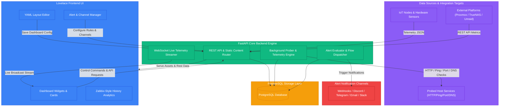

# HomePulse

HomePulse is a community-focused, highly modular framework for real-time telemetry monitoring and dashboard visualization. Inspired by Home Assistant's Lovelace design, it consumes telemetry streams from local nodes, custom servers, microcontrollers, and external infrastructure platforms, displaying them on a lightweight, highly responsive interface.

---

## Technical Architecture Overview



*   **Frontend**: Built on HTML5, Vanilla JavaScript (ES6+), and tailored CSS themes. Dynamic icon rendering is powered by Lucide Icons, and telemetry analytics charts utilize Chart.js.
*   **Backend**: Managed by a Python `FastAPI` instance running on Uvicorn. It handles WebSocket notification streams, runs background network prober background workers, processes telemetry logs, evaluates multi-channel alert rules, and manages API keys and node dependencies.
*   **Database**: PostgreSQL serves as the persistent storage layer for device configurations, approved endpoints, telemetry history, service check targets, alert rules, and user preferences.

---

## Core UI Modules & Capabilities

### 1. Advanced Lovelace YAML Layouts
*   Configure widgets dynamically via in-browser raw YAML updates.
*   Widget types include Semicircular Gauges, Glance Grids, and Entity lists.
*   Supports a **Compact Room Layout** mode alongside standard grid views.

### 2. Flexible Host Manager
*   Configure and probe remote servers, network devices, and infrastructure nodes.
*   Supports a persistent **Grid/List View** preference saved in the client's `localStorage` (`hp_hosts_layout`).

### 3. Built-in Service & Network Probers (Monitors)
*   Supports 5 distinct check types: `http`, `https`, `ping`, `port` (TCP), `dns`, and `websocket`.
*   Configurable check intervals, timeouts, and monitor grouping into status cards.
*   Live status tracking (UP/DOWN/WARNING), latency sparklines, and historical uptime telemetry logging.

### 4. Multi-Channel Alert System & Trigger Flows
*   **Notification Channels**: Webhooks, Discord, Telegram, Email, and Slack alerts.
*   **Alert Rules**: Threshold-based logic (e.g. CPU > 90%, latency > 100ms, monitor status == DOWN) with custom severity levels (`info`, `warning`, `error`, `critical`).
*   **Alert Flows**: Pipeline triggers connecting alert rules to specific notification channels.
*   Includes channel testing endpoint (`POST /api/alerts/channels/test`) to verify integration webhooks.

### 5. Zabbix-Style History Analytics
*   Filter telemetry history via preset timeframes (1h, 3h, 12h, 24h, 7d, 30d) or input a **Custom Date-Time Range**.
*   Shift query windows backward (`<`) and forward (`>`) by the timeframe increment.
*   Calculates and renders a rose-dashed **Average Latency Guideline** overlay on history charts.
*   Adapts chart x-axis ticks to include dates or weekday names for query ranges exceeding 24 hours.

### 6. Collapsible Hover Logs Table Drilldown
*   Detailed history logs are nested within a collapsible `<details>` panel ("Advanced Telemetry Records").
*   Hovering over any point on the line chart dynamically filters the log list to display records within a ±2 minute window of the hovered timestamp.

### 7. External Infrastructure Integrations
*   Native documentation and integration support for **Proxmox (VE, PBS, PMG)**, **TrueNAS SCALE**, **Unraid**, **Dockhand**, and **Nginx**.
*   Full REST API & WebSocket integration specs provided in the [`api_documentation`](./api_documentation/) directory.

### 8. API Key & Security Management
*   Manage API key tokens (`/api/settings/keys`) for authenticating nodes and integration agents.
*   Validate system environment requirements via backend dependency checks (`/api/dependencies`).

### 9. Custom Promise Dialogs
*   All critical system warnings, delete calls, and prompts use non-blocking HTML promise modal overlays instead of native browser alerts.

---

## Database Schema Directory

Below is a reference of the key PostgreSQL database tables managed by HomePulse:

| Table | Purpose | Primary Specifications |
| :--- | :--- | :--- |
| `nodes` | Network endpoints tracked by discovery | `id` (PK), `name`, `status`, `version`, `hardware_model`, `mac_address`, `approved_at` |
| `entities` | Telemetry channels associated with nodes | `id` (PK), `node_id` (FK), `entity_key`, `name`, `type` ('sensor'/'control'), `unit` |
| `telemetry_logs` | High-frequency telemetry log entries | `id` (PK), `node_id`, `entity_key`, `value`, `timestamp` |
| `system_settings` | Key-value settings registry | `key` (PK), `value` (polling interval, timezone, system theme, pincode key) |
| `system_monitors` | Core service check target specifications | `id` (PK), `name`, `type`, `target`, `check_interval`, `timeout`, `last_status`, `enabled` |
| `hosts` | User-managed remote host manager targets | `id` (PK), `name`, `target`, `ping_enabled`, `http_enabled`, `https_enabled` |
| `dashboard_config` | Lovelace layout representation configurations | `key` (PK), `value` (raw YAML representation) |
| `notification_channels` | Configured notification endpoints | `id` (PK), `name`, `type` (webhook/discord/telegram/email/slack), `config` |
| `alert_rules` | User-defined alert condition rules | `id` (PK), `entity_key`, `rule_condition`, `warning_level`, `enabled` |
| `alert_flows` | Pipelines connecting alert rules to channels | `id` (PK), `rule_id` (FK), `channel_id` (FK), `enabled` |
| `monitor_groups` | Logical grouping categories for service monitors | `id` (PK), `name`, `description` |
| `api_keys` | API keys for external agent authentication | `id` (PK), `key_name`, `api_key`, `created_at` |
| `node_dependencies` | System dependency requirements registry | `id` (PK), `name`, `version`, `status` |
| `system_audits` | Logging system actions, alerts, or errors | `id` (PK), `type`, `message`, `timestamp` |

---

## API Router Reference

### 1. WebSocket Live Stream
*   **Endpoint**: `GET /ws` or `GET /api/ws/client`
*   **Description**: Establishes bi-directional communication to stream telemetry, system audits, and discovery queue updates live to client dashboards.

### 2. Device Controllers
*   **Endpoint**: `POST /api/control/{node_id}/{entity_key}`
*   **Payload**: `{"value": <any>}`
*   **Description**: Controls active IoT switches or sliders, broadcasting state changes to all connected clients.

### 3. Service Monitors & Groups
*   **Endpoints**:
    *   `GET /api/monitors` - List all configured service probers.
    *   `POST /api/monitors` - Add a new service prober target (`http`, `ping`, `port`, `dns`, `websocket`).
    *   `PUT /api/monitors/{id}` / `DELETE /api/monitors/{id}` - Update or delete a monitor.
    *   `POST /api/monitors/{id}/toggle` - Enable or disable a prober.
    *   `GET /api/monitor-groups` - Fetch monitor groups for status dashboards.

### 4. Alerting & Notification System
*   **Endpoints**:
    *   `GET /api/alerts/channels` - List notification channels (Webhooks, Discord, Telegram, Email, Slack).
    *   `POST /api/alerts/channels` / `DELETE /api/alerts/channels/{id}` - Manage notification channels.
    *   `POST /api/alerts/channels/test` - Trigger a test alert to verify notification channel setup.
    *   `GET /api/alerts/rules` - List defined alert rules and conditions.
    *   `POST /api/alerts/rules` / `DELETE /api/alerts/rules/{id}` - Manage alert rules.
    *   `GET /api/alerts/flows` - List alert flows connecting rules to channels.

### 5. Telemetry History API
*   **Endpoint**: `GET /api/monitors/logs/{entity_key}`
*   **Parameters**:
    *   `hours`: Number of hours offset (1, 3, 12, 24, 168, 720).
    *   `offset`: Zabbix-style backward time offset shift.
    *   `start_time` / `end_time` *(Optional)*: Timezone-naive datetime-local filter bounds.
*   **Description**: Returns sorted chronological telemetry log records for charts and collapsible detail tables.

### 6. Host Manager API
*   **Endpoints**: `GET /api/hosts`, `POST /api/hosts`, `PUT /api/hosts/{id}`, `DELETE /api/hosts/{id}`
*   **Description**: Manages remote host targets, ping check toggles, and status probers.

### 7. Settings, API Keys & Dependencies
*   **Endpoints**:
    *   `GET /api/settings`, `POST /api/settings` - Retrieve & save global settings (intervals, timezone, theme).
    *   `GET /api/settings/keys`, `POST /api/settings/keys`, `DELETE /api/settings/keys/{id}` - Manage authentication API keys.
    *   `GET /api/dependencies`, `POST /api/dependencies`, `DELETE /api/dependencies/{id}` - Manage dependency requirements.

### 8. System Support & Diagnostics
*   **Endpoints**:
    *   `GET /api/support/logs` - Fetch system log diagnostics.
    *   `POST /api/support/prune` - Manually trigger log retention pruning.

---

## Maintenance & Administration CLI

HomePulse includes a robust administrative script (`maintenance.sh` / `update.sh`) located in the root directory. To run:

```bash
chmod +x maintenance.sh
./maintenance.sh
```

### CLI Command Options
1.  **Backup System Database**: Creates gzipped schemas and SQL table backups, rotating archives to preserve only the 3 most recent backups.
2.  **Restore Database**: Scans the backup archives directory, updates permissions, and imports selected configurations.
3.  **Delete Backups Menu**: Provides an interactive terminal menu list to purge specific archives.
4.  **Perform Fresh Installation**: Wipes existing configurations, databases, and logs, returning HomePulse to its initial clean-slate state.

---

## Documentation Directory Guide

For additional technical reference, architecture details, and external platform guides, explore the following workspace directories:

*   📁 **[`api_documentation/`](./api_documentation/)**: Detailed REST and WebSocket integration guides for external platforms and built-in monitors:
    *   `built_in_monitors.md`: Configuration & schema specs for built-in HTTP/Ping/Port/DNS probers.
    *   `proxmox/`: API guides for Proxmox VE (`pve.md`), Backup Server (`pbs.md`), and Mail Gateway (`pmg.md`).
    *   `truenas/`: TrueNAS SCALE monitoring and telemetry setup guide (`scale.md`).
    *   `unraid/`, `nginx/`, `dockhand/`: Additional service integration guides.
*   📁 **[`Reference/`](./Reference/)**: Comprehensive technical documentation, architectural designs, and system specifications.
*   📁 **[`brainstorm/`](./brainstorm/)**: Technical brainstorming notes, feature roadmaps, and experimental concepts (secondary reference).

---

## Local Development Deployment

Start the development multi-container Docker compose service stack:

```bash
# Spin up configurations in background mode
docker compose up -d --build
```
