# HomePulse

HomePulse is a community-focused, highly modular framework for real-time telemetry monitoring and dashboard visualization. Inspired by Home Assistant's Lovelace design, it consumes telemetry streams from local nodes, custom servers, microcontrollers, and external infrastructure platforms, displaying them on a lightweight, highly responsive interface.

---

## Technical Architecture Overview

```mermaid
graph TD
    classDef client fill:#3b82f6,stroke:#1d4ed8,color:#fff;
    classDef api fill:#10b981,stroke:#047857,color:#fff;
    classDef db fill:#f59e0b,stroke:#d97706,color:#fff;
    classDef bg fill:#8b5cf6,stroke:#6d28d9,color:#fff;
    classDef alert fill:#ef4444,stroke:#b91c1c,color:#fff;

    subgraph Data_Sources["Data Sources & Integration Targets"]
        Nodes["IoT Nodes & Hardware Sensors"]
        Probers["Probed Host Services (HTTP/Ping/Port/DNS/WS)"]
        ExtAPI["External Platforms (Proxmox / TrueNAS / Unraid)"]
    end

    subgraph Backend_Engine["FastAPI Core Backend Engine"]
        API_Server["REST API & Static Content Router"]
        WS_Server["WebSocket Live Telemetry Streamer"]
        Mon_Worker["Background Prober & Telemetry Engine"]
        Alert_Engine["Alert Evaluator & Flow Dispatcher"]
        Plugin_Runtime["Plugin Engine & Process Watchdog"]
    end

    subgraph Storage["PostgreSQL Storage Layer"]
        DB[(PostgreSQL Database)]
    end

    subgraph Dashboard["Lovelace Frontend UI"]
        UI_Dash["Dashboard Widgets & Cards"]
        UI_YAML["YAML Layout Editor"]
        UI_Analytics["Zabbix-Style History Analytics"]
        UI_Alerts["Visual Flow Alert Canvas"]
        UI_Plugins["Plugin Marketplace & Manager"]
    end

    subgraph Notifications["Alert Notification Channels"]
        Webhook["Webhooks / Discord / Telegram / Email / Slack"]
    end

    Nodes -->|Telemetry JSON| API_Server
    Mon_Worker -->|HTTP / Ping / Port / DNS Checks| Probers
    ExtAPI -->|REST API Metrics| API_Server

    API_Server --> DB
    Mon_Worker --> DB
    Alert_Engine --> DB
    Plugin_Runtime --> DB

    WS_Server -->|Live Broadcast Stream| UI_Dash
    API_Server -->|Serve Assets & REST Data| Dashboard
    Plugin_Runtime -->|Push Plugin States| API_Server

    UI_Dash -->|Control Commands & API Requests| API_Server
    UI_YAML -->|Save Dashboard Config| API_Server
    UI_Alerts -->|Configure Rules & Channels| API_Server
    UI_Plugins -->|Manage Plugins| API_Server

    Alert_Engine -->|Trigger Notifications| Webhook

    class Dashboard,UI_Dash,UI_YAML,UI_Analytics,UI_Alerts,UI_Plugins client;
    class Backend_Engine,API_Server,WS_Server,Mon_Worker,Alert_Engine,Plugin_Runtime api;
    class Storage,DB db;
    class Data_Sources,Nodes,Probers,ExtAPI bg;
    class Notifications,Webhook alert;
```



*   **Frontend**: Built on HTML5, Vanilla JavaScript (ES6+), and tailored CSS themes. Dynamic icon rendering is powered by Lucide Icons, and telemetry analytics charts utilize Chart.js.
*   **Backend**: Managed by a Python `FastAPI` instance running on Uvicorn. It handles WebSocket notification streams, background network probers, telemetry persistence, multi-channel alert rule evaluation, plugin subprocess lifecycle watchdogs, and API token security.
*   **Database**: PostgreSQL serves as the persistent storage layer for device configurations, approved endpoints, telemetry history, service check targets, alert rules, plugin configs, and user preferences.

---

## Core UI Modules & Capabilities

### 1. Advanced Lovelace YAML Layouts
*   Configure widgets dynamically via in-browser raw YAML updates with instant preview.
*   Widget types include Semicircular Gauges, Glance Grids, and Entity Lists.
*   Supports a **Compact Room Layout** mode alongside standard grid views.

### 2. Flexible Host Manager
*   Configure and probe remote servers, network devices, and infrastructure nodes.
*   Supports a persistent **Grid/List View** preference saved in the client's `localStorage` (`hp_hosts_layout`).
*   Nested host topology grouping displays child service monitors under parent host cards.

### 3. Built-in Service & Network Probers (Monitors)
*   Supports 6 distinct check types: `http`, `https`, `ping`, `port` (TCP), `dns`, and `websocket`.
*   Configurable check intervals, timeouts, and monitor grouping into status cards.
*   Live status tracking (UP/DOWN/WARNING), latency sparklines, and historical uptime telemetry logging.

### 4. Multi-Channel Alert System & Visual Flow Editor
*   **Notification Channels**: Webhooks, Discord, Telegram, Email, and Slack alerts.
*   **Alert Rules**: Threshold-based logic (e.g. CPU > 90%, latency > 100ms, monitor status == DOWN) with custom severity levels (`info`, `warning`, `error`, `critical`).
*   **Visual Flow Canvas**: Interactive node-based drag-and-drop canvas for connecting alert rules to notification channels.
*   Includes channel testing endpoint (`POST /api/alerts/channels/test`) to verify integration webhooks.

### 5. Infrastructure Dependency Hierarchy & Smart Alert Suppression
*   Define parent-child node dependency hierarchies (`node_dependencies`) between infrastructure layers.
*   Intelligent alert suppression prevents notification storms: if an upstream core router or host fails, cascade alerts from dependent child services are automatically silenced.

### 6. Plugins Marketplace & Runtime Engine
*   Browse official and community plugins via the in-app marketplace.
*   Subprocess execution with isolated environments, watchdog monitoring, and automatic health-check restarts.
*   Encrypted configuration storage using Fernet symmetric encryption keys (`cryptography`).
*   Real-time gateway API for plugins to register dynamic entities and stream telemetry/logs into HomePulse.

### 7. Zabbix-Style History Analytics
*   Filter telemetry history via preset timeframes (1h, 3h, 12h, 24h, 7d, 30d) or input a **Custom Date-Time Range**.
*   Shift query windows backward (`<`) and forward (`>`) by the timeframe increment.
*   Calculates and renders a rose-dashed **Average Latency Guideline** overlay on history charts.
*   Adapts chart x-axis ticks to include dates or weekday names for query ranges exceeding 24 hours.

### 8. Collapsible Hover Logs Table Drilldown
*   Detailed history logs are nested within a collapsible `<details>` panel ("Advanced Telemetry Records").
*   Hovering over any point on the line chart dynamically filters the log list to display records within a ±2 minute window of the hovered timestamp.

### 9. External Infrastructure Integrations
*   Built-in integration and monitoring support for **Proxmox (VE, PBS, PMG)**, **TrueNAS SCALE**, **Unraid**, **Dockhand**, and **Nginx**.
*   Standardized REST API and WebSocket protocols allow custom external agents and hypervisors to report telemetry directly into HomePulse.

### 10. API Key & Security Management
*   Manage API key tokens (`/api/settings/keys`) for authenticating nodes, agents, and automation scripts.
*   Validate system environment requirements via backend dependency checks (`/api/dependencies`).

### 11. Custom Promise Dialogs
*   All critical system warnings, delete calls, and prompts use non-blocking HTML promise modal overlays instead of native browser alerts.

---

## Database Schema Directory

Below is a reference of the key PostgreSQL database tables managed by HomePulse:

| Table | Purpose | Primary Specifications |
| :--- | :--- | :--- |
| `nodes` | Network endpoints tracked by discovery | `id` (PK), `name`, `status`, `version`, `hardware_model`, `mac_address`, `approved_at` |
| `entities` | Telemetry channels associated with nodes | `id` (PK), `node_id` (FK), `entity_key`, `name`, `type` ('sensor'/'control'), `unit` |
| `telemetry_logs` | High-frequency telemetry log entries | `id` (PK), `node_id`, `entity_key`, `value`, `timestamp` |
| `system_settings` | Key-value settings registry | `key` (PK), `value` (polling interval, timezone, system theme, pincode key) |
| `system_monitors` | Core service check target specifications | `id` (PK), `name`, `type`, `target`, `check_interval`, `timeout`, `last_status`, `enabled` |
| `hosts` | User-managed remote host manager targets | `id` (PK), `name`, `target`, `ping_enabled`, `http_enabled`, `https_enabled` |
| `dashboard_config` | Lovelace layout representation configurations | `key` (PK), `value` (raw YAML representation) |
| `notification_channels` | Configured notification endpoints | `id` (PK), `name`, `type` (webhook/discord/telegram/email/slack), `config` |
| `alert_rules` | User-defined alert condition rules | `id` (PK), `entity_key`, `rule_condition`, `warning_level`, `enabled` |
| `alert_flows` | Pipelines connecting alert rules to channels | `id` (PK), `rule_id` (FK), `channel_id` (FK), `enabled` |
| `active_alerts` | Tracks currently firing system alerts | `id` (PK), `rule_id`, `entity_key`, `message`, `warning_level`, `fired_at`, `resolved_at` |
| `alert_cooldowns` | Prevents repeated alert dispatch storms | `entity_key` (PK), `rule_id`, `last_fired` |
| `monitor_groups` | Logical grouping categories for service monitors | `id` (PK), `name`, `description` |
| `monitor_group_map` | Associates individual monitors with monitor groups | `group_id` (FK), `monitor_id` (FK) |
| `plugins` | Installed plugins registry and status | `id` (PK), `name`, `version`, `enabled`, `config` (JSONB), `created_at` |
| `plugin_entity_states` | Entities and telemetry emitted by plugins | `entity_key` (PK), `plugin_id` (FK), `node_id`, `name`, `type`, `value`, `attributes` (JSONB) |
| `api_keys` | API keys for external agent authentication | `id` (PK), `key_name`, `api_key`, `created_at` |
| `node_dependencies` | Infrastructure parent-child hierarchy | `id` (PK), `parent_node_id`, `child_node_id`, `status` |
| `system_audits` | Logging system actions, alerts, or errors | `id` (PK), `type`, `message`, `timestamp` |

---

## API Router Reference

### 1. WebSocket Live Stream
*   **Endpoint**: `GET /api/ws/client`
*   **Description**: Establishes bi-directional communication to stream telemetry, system audits, and discovery queue updates live to client dashboards.

### 2. Device Controllers
*   **Endpoint**: `POST /api/entities/control/{node_id}/{entity_id}`
*   **Payload**: `{"value": <any>}`
*   **Description**: Controls active IoT switches or sliders, broadcasting state changes to all connected clients.

### 3. Service Monitors & Groups
*   **Endpoints**:
    *   `GET /api/monitors` - List all configured service probers.
    *   `POST /api/monitors` - Add a new service prober target (`http`, `https`, `ping`, `port`, `dns`, `websocket`).
    *   `PUT /api/monitors/{id}` / `DELETE /api/monitors/{id}` - Update or delete a monitor.
    *   `POST /api/monitors/{id}/toggle` - Enable or disable a prober.
    *   `GET /api/monitor-groups` - Fetch monitor groups for status dashboards.
    *   `POST /api/monitor-groups` / `DELETE /api/monitor-groups/{id}` - Manage monitor groups.

### 4. Alerting & Notification System
*   **Endpoints**:
    *   `GET /api/alerts/channels` - List notification channels (Webhooks, Discord, Telegram, Email, Slack).
    *   `POST /api/alerts/channels` / `DELETE /api/alerts/channels/{id}` - Manage notification channels.
    *   `POST /api/alerts/channels/test` - Trigger a test alert to verify notification channel setup.
    *   `GET /api/alerts/rules` - List defined alert rules and conditions.
    *   `POST /api/alerts/rules` / `DELETE /api/alerts/rules/{id}` - Manage alert rules.
    *   `GET /api/alerts/flows` - List alert flows connecting rules to channels.
    *   `POST /api/alerts/flows` / `DELETE /api/alerts/flows/{id}` - Manage alert flow pipelines.

### 5. Plugins Management API
*   **Endpoints**:
    *   `GET /api/plugins/marketplace` - Browse official and community plugin repository.
    *   `GET /api/plugins/installed` - List installed plugins, enabled state, and subprocess status.
    *   `POST /api/plugins/install/{id}` - Install a plugin from the marketplace.
    *   `POST /api/plugins/uninstall/{id}` - Remove an installed plugin.
    *   `POST /api/plugins/toggle/{id}` - Start or stop a plugin subprocess.
    *   `POST /api/plugins/config/{id}` - Save encrypted plugin settings.
    *   `GET /api/plugins/logs/{id}` - Retrieve live stdout/stderr execution logs for a plugin.
    *   `GET /api/plugins/readme/{id}` - View plugin documentation and usage instructions.
    *   `POST /api/plugins/gateway/state` - Ingest endpoint for plugins to push entity states.
    *   `POST /api/plugins/gateway/logs` - Ingest endpoint for plugins to stream runtime logs.

### 6. Telemetry History API
*   **Endpoint**: `GET /api/monitors/logs/{entity_key}`
*   **Parameters**:
    *   `hours`: Number of hours offset (1, 3, 12, 24, 168, 720).
    *   `offset`: Zabbix-style backward time offset shift.
    *   `start_time` / `end_time` *(Optional)*: Timezone-naive datetime-local filter bounds.
*   **Description**: Returns sorted chronological telemetry log records for charts and collapsible detail tables.

### 7. Host Manager API
*   **Endpoints**: `GET /api/hosts`, `POST /api/hosts`, `PUT /api/hosts/{id}`, `DELETE /api/hosts/{id}`
*   **Description**: Manages remote host targets, ping check toggles, and status probers.

### 8. Dashboard Configuration API
*   **Endpoints**:
    *   `GET /api/dashboard/config` - Retrieve current Lovelace raw YAML layout configuration.
    *   `POST /api/dashboard/config` - Save and apply updated Lovelace YAML layout.

### 9. Settings, API Keys & Dependencies
*   **Endpoints**:
    *   `GET /api/settings`, `POST /api/settings` - Retrieve & save global settings (intervals, timezone, theme).
    *   `GET /api/settings/keys`, `POST /api/settings/keys`, `DELETE /api/settings/keys/{id}` - Manage authentication API keys.
    *   `GET /api/dependencies`, `POST /api/dependencies`, `DELETE /api/dependencies/{id}` - Manage dependency hierarchy and alert suppression.

### 10. System Version, Health & Diagnostics
*   **Endpoints**:
    *   `GET /api/health` - Database connection and backend health check.
    *   `GET /api/version` - Retrieve current HomePulse build version.
    *   `GET /api/support/logs` - Fetch system log diagnostics.
    *   `POST /api/support/prune` - Manually trigger log retention pruning.

---

## Maintenance & Administration CLI

HomePulse includes a comprehensive administrative shell script (`maintenance.sh`) located in the root directory:

```bash
chmod +x maintenance.sh
./maintenance.sh
```

You can also run automated first-time setups directly:
```bash
./maintenance.sh --first-install
```

### CLI Operations Menu
1.  **Run Manual Database Backup**: Creates a timestamped gzipped SQL dump of the PostgreSQL database saved to `./db_backups/manual/`.
2.  **Restore Database from Backup**: Scans both automatic and manual backup directories, letting you interactively pick and restore an archive.
3.  **Delete a Manual Backup**: Interactive selection menu to remove older manual backup archives.
4.  **Force Rebuild and Restart Stack**: Re-executes `docker compose up -d --build` to apply recent code or dependency updates.
5.  **Check for Updates**: Compares your local git commit/tag against the remote repository branch and prompts to pull updates.
6.  **Perform First-Time Installation**: Prepares the `.env` secret keys, tests Docker dependencies, and builds the container stack.
7.  **Perform Fresh Install (Destructive)**: Completely wipes the PostgreSQL volume (`postgres_data`) and recreates containers with default factory settings.
8.  **Force Regenerate Environment Credentials**: Regenerates database passwords and JWT secret keys in `.env` (requires container restart).

---

## Local Development Deployment

Start the development multi-container Docker compose service stack:

```bash
# Spin up configurations in background mode
docker compose up -d --build
```
